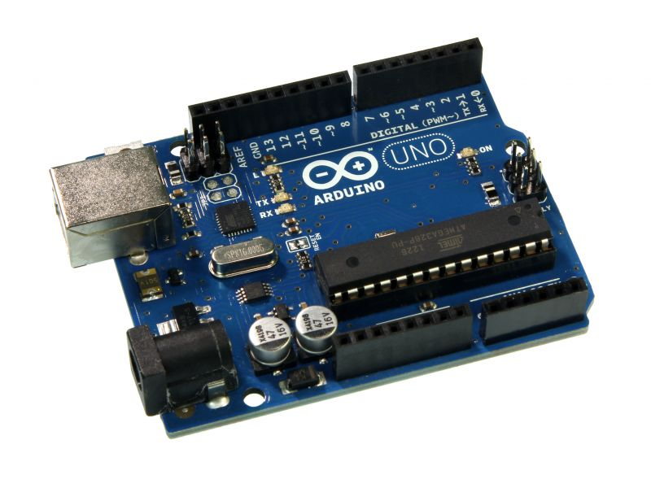

# Inteligentne systemy pomiarowe - projekt 1

## Cel projektu
Stworzyć aplikację pomiarową pozwalającą na komunikację z wykorzystaniem szyny danych CAN. Praca nad zadaniem projektowym wymaga wykorzystania zestawu Arduino + CAN Bus Shield + czujników CAN.

## CAN - co to jest?
CAN (Controller Area Network) to szeregowa magistrala komunikacyjna opracowana przez firmę Bosch GmbH w latach 80 XXw. Powstała ona w odpowiedzi na potrzebę znalezienia odpowiedniej metody komunikacji dla systemów kontrolnych, zapewniającej szybką i pozbawioną błędów transmisję danych między elementami wykonawczymi i moniturojącymi. W owych czasach była rewolucyjna pod względem niezawodności, łatwości implementacji, szybkości działania, zostając przy tym stosunkowo tanim rozwiązaniem. Jej głownym przeznaczeniem jest przemysł, w szczególności transport i przemysł maszynowy. 

## Podstawy teoretyczne działania szyny CAN
Specyfikacja CAN definiuje dwie pierwsze warstwy modelu ISO OSI, tj. warstwę fizyczną i warstwę łącza danych. Pozostałe warstwy, poza ostatnią (warstwą aplikacji), której implementacja zależy od projektanta sytemu, są nieużywane. 
### 1. Warstwa fizyczna określa:
  - topologię sieci - CAN jest magistralą, czyli wszystkie urządzenia połączonne są szeregowo wpólną szyną transmisyjną. Szyna składa się z dwóch lini: CAN_L i CAN_H. Minimalną liczbą przewodów do realizacji sieci CAN jest zatem kabel dwużyłowy. W celu eliminacji odbicia sygnałów na końcach magistrali stosuje się rezystory terminujące.
  
  - prędkość i zasięg transmisji - maksymalną dopuszczalną prędkością przesyłania danych jest 1Mb/s, jednak jest ona zależna od długości medium przesyłowego. Ważne jest, aby wszystkie urządzenia podłączone do magistrali działały z tą samą prędkością transmisji.  
  
  - kodowanie -  CAN wykorzystuje kodowanie NRZ (non-return to zero)
    - jedynce logicznej odpowiada stan wysoki
    - zeru logicznemu odpowiada stan niski
    
    Wysłanie tego samego bitu 5 razy pod rząd budzi jednak podejrzenia, więc nadawca po 5 takich samych bitach "wpycha" bit o wartości przeciwnej (tzw. Bit stuffing). W ten sposób mamy pewność co do poprawnego działania magistrali.
    
  - stany sygnału magistrali - CAN przesyła informacje metodą różnicową - stany odpowiadają różnicy napięć między liniami CAN_L i CAN_H. Istnieją dwa stany magistrali:
    - recesywny - napięcie na obu liniach równe, wynoszące 2-3V - reprezentuje jedynkę logiczną
    - dominujący - 2.75-4.5V na lini CAN_H i 0.5V-2.25V na lini CAN_L - reprezentuje zero logiczne
  

### 2. Warstwa łącza danych określa:
  - format ramki CAN - istnieją 4 rodzaje ramek:
    - data frame 
      - standardowa (CAN 2.0A) - 11-bitowa długość adresu
      
      - rozszerzona (CAN 2.0B) - 29-bitowa długość adresu
    - remote frame
    - error frame
    - overload frame  
  - model komunikacji - infrastruktura multi-master - każde z urządzeń może pełnić funkcje mastera. Każdy węzeł może rozgłaszać wiadomości w sposób wolny, to od konfiguracji węzła docelowego zależy, czy zaakceptuje daną wiadomość.
  - dostęp do medium - metoda CSMA/CR (zmodyfikowana CSMA/CD) - w wyniku wystąpienia kolizji, jedna z wiadomości nadal jest przesyłana, natomiast druga (pozostałe) zostają wysłane po zwolnieniu medium. O tym, która zostanie wysłana decyduje priorytet określany na podstawie adresu (ID). 
  - wykrywanie błędów - CAN wykorzystuje wiele metod wykrywania błędów, np.:
    - suma CRC
    - potwierdzenie otrzymania wiadomości
    - Bit Stuffing
    - sprawdzanie poprawności ramki (zawieranie odpowiednich pól)
    - sprawdzanie poprawności wystawionego bitu

### Architektura
Z punktu widzenia projektu, kluczowe jest rozróżnienie 3 różnych metod projektowania węzła CAN.
1. **Węzeł zbudowany z trzech elementów - mikrokontrolera, kontrolera CAN i transceivera CAN - wykorzystana metoda.**
2. Węzeł zbudowany z mikrokontrolera z kontrolerem CAN i transceivera.
3. Mikrokontroler z wbudowanym kontrolerem CAN i transceiverem.

## Urządzenia
Arduino Leonardo

Arduino Uno

Arduino CAN-Bus Shield

Przewód db9-db9

## Schemat połączeniowy

## Algorytm
Przed rozpoczęciem **świadomej** pracy z projektem, należy zapoznać się z biblioteką CAN_BUS_SHIELD od Seeed-Studio (https://github.com/Seeed-Studio/CAN_BUS_Shield). W celu lepszego zrozumienia działania programu warto również odnieść się do dokumentacji modułów MCP2515 (CAN bus controller http://ww1.microchip.com/downloads/en/DeviceDoc/21801d.pdf) i MCP2551 (CAN transceiver http://www.microchip.com/wwwproducts/en/en010405). 
### 1. Arduino
  - Sender - 
  - Receiver
### 2. PC

## Sposób uruchomienia
W celu kompilacji programów na platformy Arduino, wymagane jest pobranie i dołączenie biblioteki CAN_BUS_SHIELD od Seeed-Studio. Wszystkie pozostałe pliki potrzebne do prawidłowego działania systemu znajdują się w tym repozytorium.
1. Wgrać odpowiedni program (sender/sender.ino lub receiver/receiver.ino) na płytki Arduino za pomocą programu Arduino IDE
- wybrać odpowiedni typ płytki
- wybrać odpowiedni port COM
- otworzyć plik źródłowy
- skompilować kod
- załadować skompilowany program do pamięci płytki
2. Podłączyć przewody komunikacyjne
- połączyć przewodem DB9-DB9 gniazda na obu shieldach
3. Zapewnić łączność komputera PC ze stroną internetową systemu smart-storm
4. Podłączyć przewody zasilające płytki Arduino
- obie płytki zasilane są przewodami USB, przy czym ważne jest, żeby najpierw uruchomić płytkę z programem receiver.ino
W tym momencie dane w odbiorniku są wystawiane na interfejs szeregowy USB, skąd mogą zostać pobrane przez skrypt napisany w języku Python.
5. Uruchomić program send.py

## Źródła
- https://smartrobots.pl/arduino-CAN-bus-shield
- https://elty.pl/pl/p/CAN-BUS-Shield-dla-Arduino/1094
- http://mikrokontroler.pl/2013/06/10/interfejs-komunikacyjny-can-podstawy/
